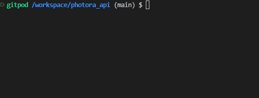
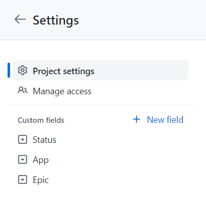

# Photora
  
Photora is a social media application that allows authenticated members to post images and share their content with other people. Members can post, like posts, comment on posts, and also edit and delete their posts. Members can also follow other members to create a personalized feed.

# Live Page
[https://photora.herokuapp.com/](https://photora.herokuapp.com/)

# Objective
The objective of this project is to present my skills in React, Typescript, Django Rest Framework and Python. I also want to show my proficiency in Object Oriented Programming and other standard programming constructs such as flow control, iteration, selection, functions, and data structures.

# React Frontend
The repository for the frontend of the application can be found here: [https://github.com/Cushione/photora_frontend](https://github.com/Cushione/photora_frontend)

# Contents
* [Endpoints](#endpoints)
  * [Authentication](#authentication)
    * [Registration](#registration)
    * [API Tokens](#api-tokens)
    * [API Tokens Refresh](#api-tokens-refresh)
  * [Profiles](#profiles)
    * [Profile List](#profile-list)
    * [Profile Detail](#profile-detail)
    * [Profile Follow](#profile-follow)
    * [User Profile](#user-profile)
  * [Posts](#posts) 
    * [Post List](#post-list)
    * [Post Detail](#post-detail)
    * [Post Like](#post-like)
    * [Post Search](#post-search)
    * [Profile Post List](#profile-post-list)
    * [Follow Post List](#follow-post-list)
    * [Liked Post List](#liked-post-list)
  * [Comments](#comments) 
    * [Comment List](#comment-list)
    * [Comment Detail](#comment-detail)
* [Testing](#testing)
  * [Manual Testing](#manual-testing)
  * [Automated Testing](#automated-testing)
  * [Validation](#validation)
    * [Python](#python)
  * [Bugs](#bugs)
* [Development process](#development-process)
  * [Development Preparation](#development-preparation)
  * [Agile Development](#agile-development)
    * [Custom Fields](#custom-fields)
  * [Git](#git)
* [Deployment](#deployment)
  * [Deployment Preparation](#deployment-preparation)
  * [Setup](#setup)
* [Credits](#credits)
  * [Used Technologies and Tools](#used-technologies-and-tools)
  * [Django Apps](#django-apps)
  * [Content and Media](#content-and-media)
* [Acknowledgments](#acknowledgments)

# Endpoints

## Authentication

### [Registration](https://photora-api.herokuapp.com/dj-rest-auth/registration/)
/dj-rest-auth/registration/
- POST: creates a new user

### [API Tokens](https://photora-api.herokuapp.com/api/token/)
/api/token/
- POST: returns a set of JWT tokens

### [API Token Refresh](https://photora-api.herokuapp.com/api/token/refresh/)
/api/token/refresh/
- POST: allows authenticated users to refresh their access token by providing a refresh token

## Profiles

### [Profile List](https://photora-api.herokuapp.com/profiles)
/profiles
- GET: returns a list of all the profiles

### [Profile Detail](https://photora-api.herokuapp.com/profiles/8)
/profiles/:id
- GET: returns the profile specified by id

### [Profile Follow](https://photora-api.herokuapp.com/profiles/8/followers)
/profiles/:id/followers
- GET: returns a list of profiles following the specified profile
- POST: allows authenticated users to follow the specified profile

### [User Profile](https://photora-api.herokuapp.com/profiles/user)
/profiles/user
- GET: returns the profile of the requesting user
- PUT: allows authenticated users to update their profile

## Posts

### [Post List](https://photora-api.herokuapp.com/posts)
/posts
- GET: returns a list of all the posts
  - Authenticated: Filters out the posts from the requesting user and from the profiles the user follows
- POST: allows authenticated users to create posts

### [Post Detail](https://photora-api.herokuapp.com/posts/12)
/posts/:id
- GET: returns the post specified by id
- PUT: allows the owner to update the post
- DELETE: allows the owner to delete the post

### [Post Like](https://photora-api.herokuapp.com/posts/12/likes)
/posts/:id/likes
- GET: returns a list of profiles that liked the specified post
- POST: allows authenticated users to like the specified post

### [Post Search](https://photora-api.herokuapp.com/posts/search?keywords=dog)
/posts/search?keywords=:keywords
- GET: returns a list of post that contain all keywords in either the title, description, or the name of the author's profile

### [Profile Post List](https://photora-api.herokuapp.com/profiles/8/posts)
/profiles/:id/posts
- GET: returns all the post from the specified profile

### [Follow Post List](https://photora-api.herokuapp.com/posts/feed)
/posts
- GET: allows authenticated users to retrieve a list of all the post from the profiles they follow

### [Liked Post List](https://photora-api.herokuapp.com/posts/liked)
/posts
- GET: allows authenticated users to retrieve a list of all the post they liked

## Comments

### [Comment List](https://photora-api.herokuapp.com/posts/18/comments)
/posts/:id/comments
- GET: returns a list of all the comments from a specified post
- POST: allows authenticated users to create comments on the specified post

### [Comment Detail](https://photora-api.herokuapp.com/posts/18/comments/20)
/posts/:id/comments/:id
- GET: returns the comment specified by id
- PUT: allows the owner to update the comment
- DELETE: allows the owner to delete the comment

# Testing
In this project, I used two types of testing: Manual explorative testing and automated tests.

## Manual Testing
- Throughout the development process, I manually tested every page and feature exhaustively.   
[List of manual tests](manual_testing.md)
- When I finished creating my MVP, I shared the website with multiple users to confirm its functionality and to get feedback on their experience.

## Automated Testing
- For the Post and Profile model, I implemented tests with the Django framework.
- The Django framework includes a testing library, so no further setup is necessary.
- I started the Django tests with the command `python3 manage.py test`.

Test results from the Django tests: All 6 tests passed.  

## Validation
### Python
  
There were no errors found in any of my python files using the [Python Linter provided by the Code Institute](https://pep8ci.herokuapp.com/).

## Bugs
**Application error in production deployment for unautherized unsafe methods**  
Unauthorized requests with unsafe methods are causing an application error in the deployed version of the drf application. Local deployment returns a 403 error as expected. Potential causes could be the remote postgres database. Not fixed due to time constraints.

# Development process
While I was working on this project, I tried to follow an agile development approach as much as possible. 

## Development Preparation
The first step in my development process was to plan the website thoroughly:
- At first, I created a simple class diagram that shows the models I was planning on implementing, with their properties and relations  
  [Link to the class diagram](https://drive.google.com/file/d/1mJWKN7ZxXBxVgPcC8Y_ZCXYZGNR4A8dm/view?usp=sharing)
- Next, I thought about the User Interface and its layout. I created simple [wireframes](docs/images/wireframes.png) for the homepage and the article detail page. 
  - Note: During development, I changed the layout of the post detail page and comments because there would not be enough space and it reduced development time by reusing existing components  
- Lastly, I wrote the majority of my user stories and tasks in my [GitHub Project](https://github.com/users/Cushione/projects/4) 

### Agile Development
- In my [GitHub Project](https://github.com/users/Cushione/projects/4), all my issues are separated into two parts of the application by a custom field "App". Each ticket was assigned one of two milestones: "MVP" and "Additional Features"
- Issues not necessary for my project were added to the "Additional Features" milestone. Those tickets were only to be worked on when all the "MVP" tickets were done and I still had time left.
- Each issue was then categorized into user stories or technical tasks by adding the corresponding label.
- All the issues were then grouped into various epics by a custom field "Epic".
- Every issue was created in added "Unspecified" column. After specification, it was moved to "Todo".
- When I was working on the project, I chose one issue to work on from the "Todo" column of the MVP board and moved it into the "In Progress" column.
- After I finished the issue by fulfilling all the acceptance criteria, I closed the issue which moved it automatically into the "Done" Column.

#### Custom fields
  
Custom fields were created in the [settings of the GitHub Project](https://github.com/users/Cushione/projects/4/settings)

### Git
- I started the program and repository by using the [gitpod python template](https://github.com/Code-Institute-Org/python-essentials-template) provided by the Code Insitute.
- Then I regularly staged my changes using the command `git add <filename>` and then committed the staged changes to my local repository using `git commit -m 'short descriptive message here'`.
- Finally, I would push the commits from my local repository up to the GitHub repository using the command `git push`.
- With every push, Heroku automatically deploys my latest commit from the 'main' branch to the Heroku app.

# Deployment

The site was deployed using Heroku.

## Deployment Preparation
Before the deployment, the following steps were taken to prepare the application for the deployment on Heroku:
- The setting DEBUG in the settings.py was set to FALSE.
- All the dependencies were stored in the requirements.txt file with the command `pip3 freeze --local > requirements.txt`.
- The start command for the application `web: gunicorn photora-api.wsgi` was stored in a Procfile.

## Setup
The steps to deploy an app to Heroku are as follows:
- Create a new App from the Heroku dashboard.
- Enter a name for the app and select a region, then click on "Create App".
- On the page of the app that opens, go to the "Settings" tab.
- In Settings add the necessary config vars, for this project I added my cloudinary URL, database URL, and django secret key
- Next, add the buildpack "Heroku/Python".
- Afterwards, go to the "Deploy" tab on the app page.
- In the "Deployment method" section, select "GitHub" and follow the steps to connect Heroku with GitHub.
- Then, in the "Connect to GitHub" section, search for the repository that is supposed to be deployed and click on "Connect".
- The last step is to either:
    - enable automatic deployment by clicking on the button "Enable Automatic Deploys" in the "Automatic Deploys" Section.
    - deploy a branch manually by selecting the branch and clicking the button "Deploy Branch" in the "Manual deploys" section.

The live link can be found here: [Photora API](https://photora-api.herokuapp.com/posts)

# Credits

## Used Technologies and Tools
- [Django Rest Framwork](https://www.django-rest-framework.org/) - As the project framework
- [Black](https://black.vercel.app/) - For formatting Python code
- [Heroku](https://www.heroku.com/) - For the deployment of the website
- [ElephantSQL](https://www.elephantsql.com/) - As the database provider
- [Cloudinary](https://cloudinary.com/) - As the image storage

## Django Apps
- [dj_rest_auth](https://pypi.org/project/dj-rest-auth/) was used for handling registration
- [django-allauth](https://pypi.org/project/django-allauth/) was used for handling registration
- [django-cors-headers](https://pypi.org/project/django-cors-headers/) was used for adding CORS headers to responses
- [rest-framework-simplejwt](https://pypi.org/project/rest-framework-simplejwt/) was used for authentication
- [cloudinary_storage and cloudinary](https://pypi.org/project/django-cloudinary-storage/) was used as the image storage

# Acknowledgements

I would like to acknowledge the following people who have helped me along the way in completing my final portfolio project:
- My husband, Moritz Wach, for all his knowledge and relentless support.
- My mentor, Spencer Barriball, for his guidance and inspiration.
- My friends and colleagues for testing the website rigorously and sharing posts and writing comments.